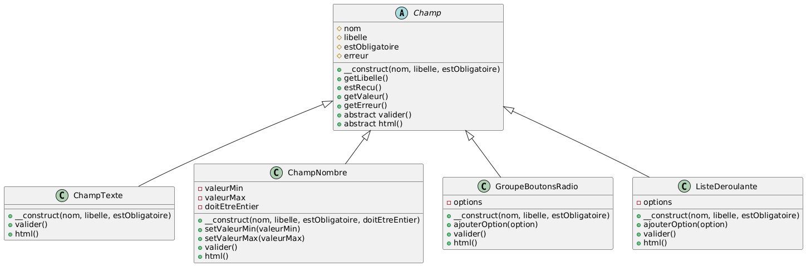
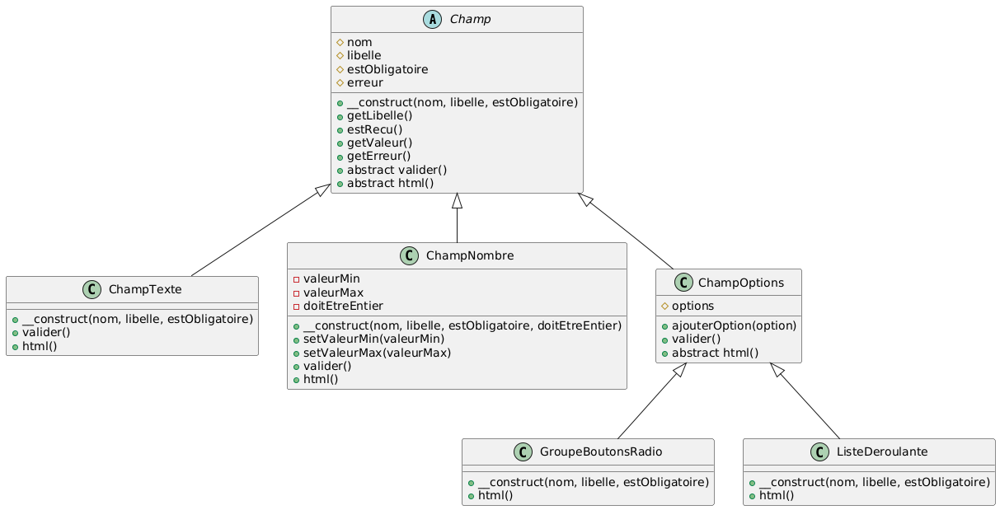

# Laboratoire 05-B

Ce laboratoire repart de la solution du laboratoire 05-A et y ajoute de l'héritage de classes.

Si vous observez attentivement le code de toutes vos classes actuelles servant à créer des champs de formulaire (`ChampTexte`, `ChampNombre`, `ListeDeroulante` et `GroupeBoutonsRadio`), vous constaterez que toutes ces classes possèdent des membres avec les noms suivants:

**Attributs**

* `$nom`
* `$libelle`
* `$estObligatoire`
* `$erreur`

**Méthodes**

* `getLibelle`
* `estRecu`
* `getValeur`
* `getErreur`
* `valider`
* `html`

Si vous vous attardez au code de chacune des méthodes, vous constaterez que **les méthodes suivantes sont complètement identiques d'une classe à l'autre:**

* `getLibelle`
* `estRecu`
* `getValeur`
* `getErreur`

Les méthodes suivantes, pour leur part, **existent dans toutes les classes, mais leurs implémentations diffèrent:**

* `valider`
* `html`

Nous pouvons utiliser l'héritage pour éviter de répéter le code qui est identique entre toutes les classes. L'héritage utilise une **classe mère** qui implémente les éléments communs, et des **classes filles** qui en héritent et n'implémentent que les éléments propres à chaque classe.

Un fichier `classes/Champ.php` a été ajouté. Observez le code de la classe qui s'y trouve. Vous constaterez que:

* cette classe est **abstraite** (mot-clé `abstract`). Une classe abstraite est une classe qui ne peut pas être instanciée directement. On ne peut qu'en hériter.
* cette classe possède les attributs `$nom`, `$libelle`,  `$estObligatoire` et `$erreur`. Ces attributs sont ceux qui existent dans toutes les classes nommées plus haut. Ils sont `protected` plutôt que `private`. Cela permet de les rendre accessibles aux classes filles.
* cette classe implémente un constructeur qui initialise les attributs.
* cette classe implémente les méthodes `getLibelle`, `estRecu`, `getValeur` et `getErreur`. Ce sont les quatre méthodes dont l'implémentation est identique dans toutes les classes nommées plus haut.
* Les méthodes `valider` et `html` sont abstraites (mot-clé **abstract**). **Une méthode abstraite n'est pas implémentée dans la classe mère, et doit obligatoirement être implémentée dans la classe fille**. C'est donc une façon de dire que toute classe qui hérite de `Champ` devra fournir une méthode `valider` et une méthode `html`, mais le code de cette méthode sera différent pour chaque classe fille.

Observez maintenant le code de la classe `ChampTexte`, qui a été modifié pour hériter (mot-clé `extends`) de `Champ`. Vous constaterez que le code de `ChampTexte` est maintenant beaucoup plus court qu'avant. Il n'est pas nécessaire de répéter tous les attributs et méthodes de `Champ` dans `ChampTexte`: cela est fait automatiquement par l'héritage. Il est cependant nécessaire d'appeler le constructeur de `Champ` dans celui de `ChampTexte` (avec `parent::__construct`), ainsi que d'implémenter les deux méthodes abstraites de `Champ` selon les particularités de `ChampTexte`.

Si vous regardez le code dans `tests/etape1.php`, vous constaterez que celui-ci n'a pas changé. Le fonctionnement externe de la classe `ChampTexte` est le même qu'avant.

## Partie 1

Modifiez le code des classes `ChampNombre`, `GroupeBoutonsRadio` et `ListeDeroulante` afin de les faire hériter de `Champ`. Les classes doivent implémenter seulement ce qui diffère par rapport à `Champ`. Inspirez-vous de ce qui a été fait dans `ChampTexte`, et testez vos nouvelles versions des classes au fur et à mesure en changeant `$etape` dans `index.php` (comme dans le Laboratoire 05-A).

Voici un diagramme représentant chacune des classes après héritage:

## Partie 2

Avez-vous remarqué que même avec la classe mère `Champ` que nous avons ajoutée, il subsiste du code similaire entre deux de nos classes? Il s'agit des classes `GroupeBoutonsRadio` et `ListeDeroulante`. Ces deux classes ajoutent un attribut `$options` et une méthode `ajouterOption`, et la méthode `valider` est identique. Pourquoi ne pas ajouter une classe `ChampOptions`, qui hériterait elle-même de `Champ`, et qui implémenterait les éléments communs entre `GroupeBoutonsRadio` et `ListeDeroulante` (qui elles-mêmes hériteraient de `ChampOptions`) ? Faites les ajouts et modifications nécessaires en vous basant sur le diagramme suivant:

